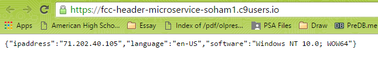

#Header Microservice

This is a solution for http://www.freecodecamp.com/challenges/request-header-parser-microservice

User Story: I can get the IP address, language and operating system for my browser.

##Screenshot

###Landing Page

##Technologies Used:
- Node.js
- Express